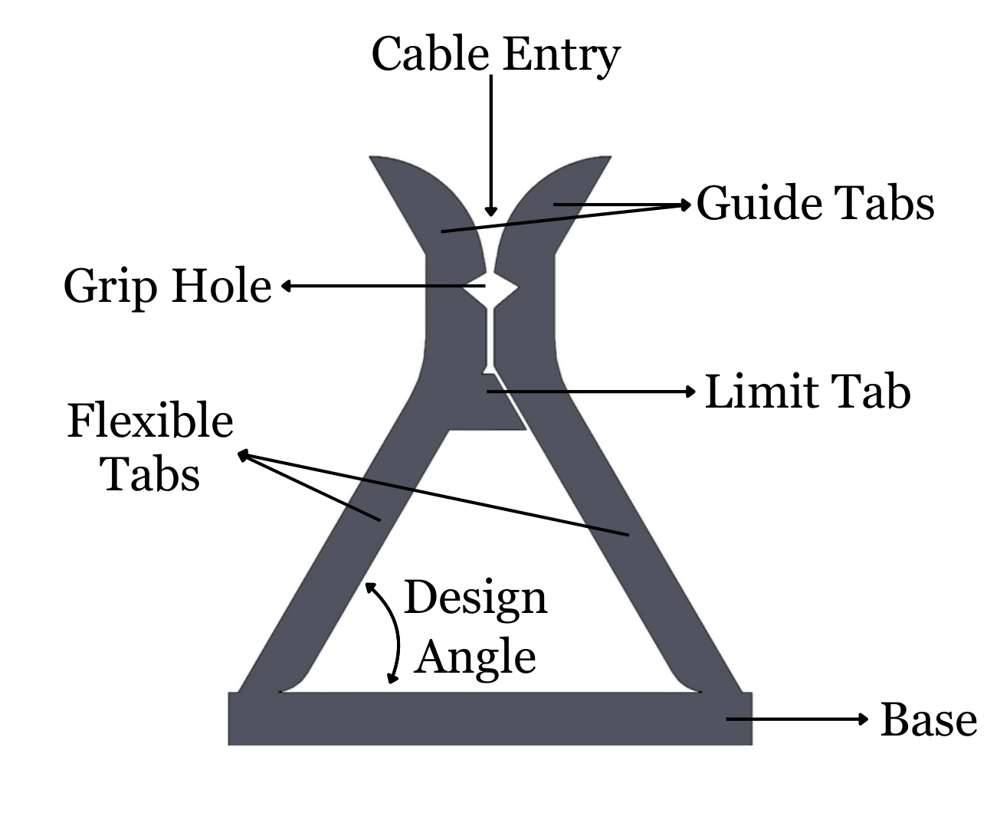
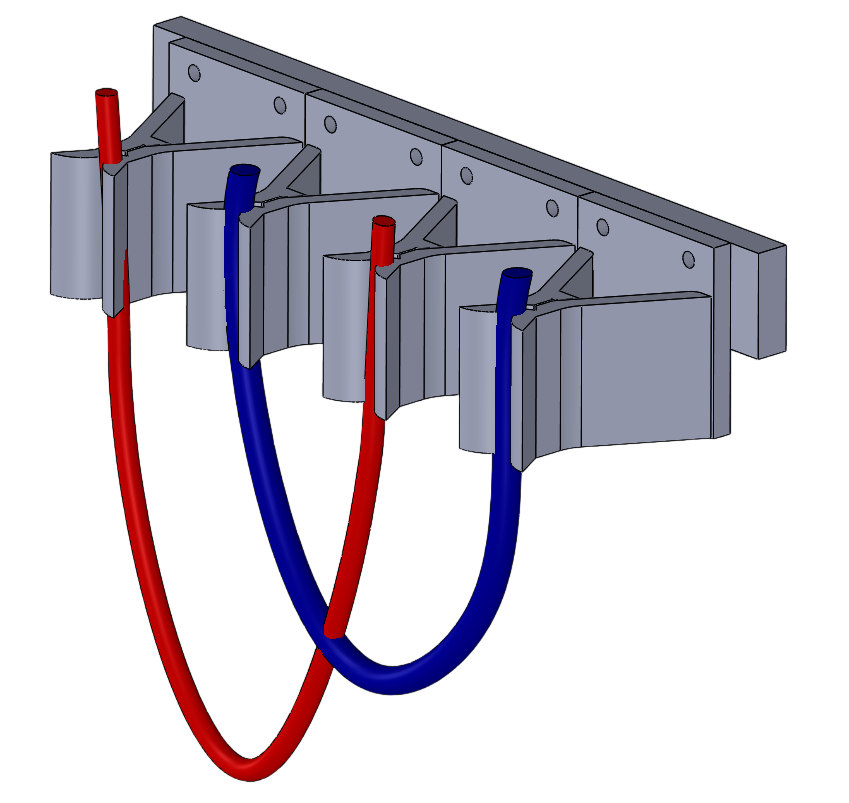
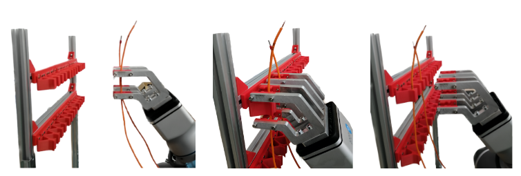

# 3D Printable Cable Clips

This repository contains STL files and design resources for 3D printable cable clips.  
The clips are designed to hold and guide cables in a modular and flexible way, suitable both for manual use and robotic applications.  

---

## Preview Images

### Design Overview
The CAD design highlights the main functional parts of the clip, including the guide tabs, limit tab, and flexible cable entry.

---

### Example Cable Arrangement
An example rendering with red and blue cables routed through the clip system.

---

### Robotic Application
Demonstration of the clips being used in a robotic cable handling setup.

---

## License
The STL files in this repository are licensed under the  
[Creative Commons Attribution 4.0 International (CC-BY 4.0)](http://creativecommons.org/licenses/by/4.0/).

